# 了解USD基本面

了解皮克斯通用场景描述（USD）的基础知识，并了解它如何帮助您构建出色的3D资产和工作流程。我们将向您介绍 USD 背后的核心概念，并探讨如何将该格式集成到您的内容创建管道中。我们还将向您展示如何通过使用组合来创建灵活和多功能的资产来利用USD的力量。

# 什么是USD？

1. USD由皮克斯动画工作室开发
2. 用来创作我们喜欢的复杂电影，并广泛用于电影，娱乐和其他行业
3. 它通过设计可扩展，并迅速成为一种协作的关键工作流技术
4.  电影行业数十年制作经验的开源项目，越来越多地被游戏AR、制造和电子商务

# USD有三个核心方面

1. 场景描述规范
2. API
3. 渲染系统

## USD API

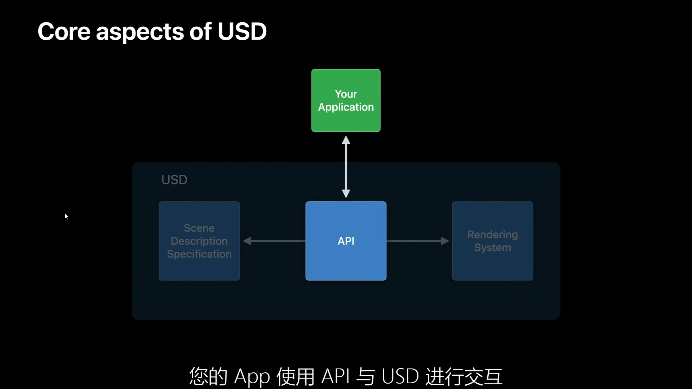

## USD 渲染系统

## 通用场景描述

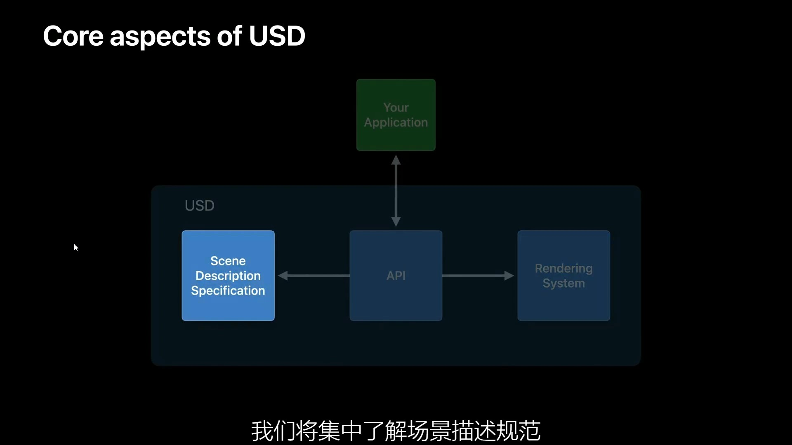

我们将重点介绍，该规范说明了如何描述如何组织以及如何以文件格式表示场景数据。 从根本上说，这些USD文件包含描述场景应该如何外观的数据。 呈现应用程序解释数据，并在屏幕上生成图像。

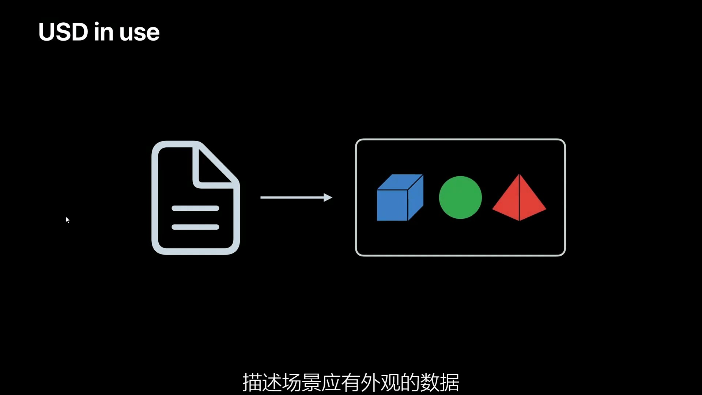

# 深入了解基本概念

现在，让我们深入了解基本概念并了解渲染背后的数据。 为简单起见，我们将使用文本 USD 表示 有很多我们很想谈论的功能但为了节省时间我们将重点介绍最常遇到例如阶段、prim 和图层，仅举几例。

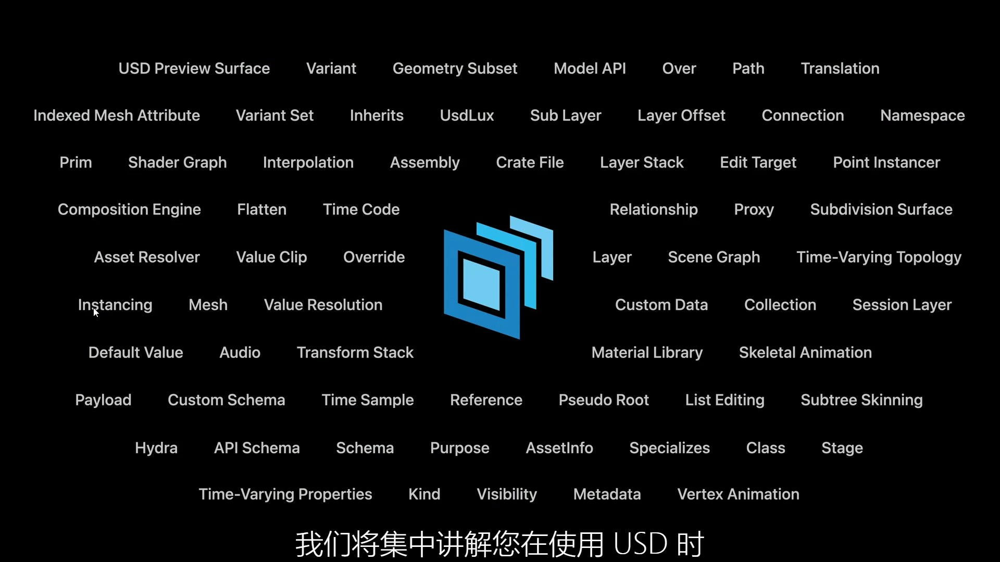

## 1、Stage（舞台）

让我们从舞台开始。 想象一下，我们正在剧院看一场戏剧。 作为观众，我们观察着舞台上演员的表演，留意环境、灯光和道具。 这很好地类比了舞台在USD中的运作方式。

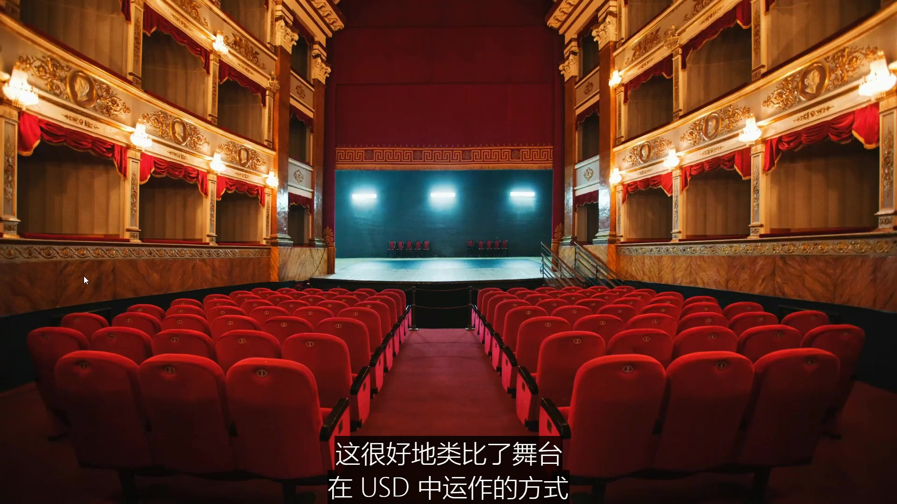

1. 一个舞台就是一个场景图表或者数据结构
2. 一个舞台是单个或多个层级的组合
3. 它们通常是包含场景信息的文件

## 2.Prim（基元）

一般来说舞台是由基元组成的，基元是场景的主要容器对象，基元可以通过包含其它基元来创建场景元素的层级结构。

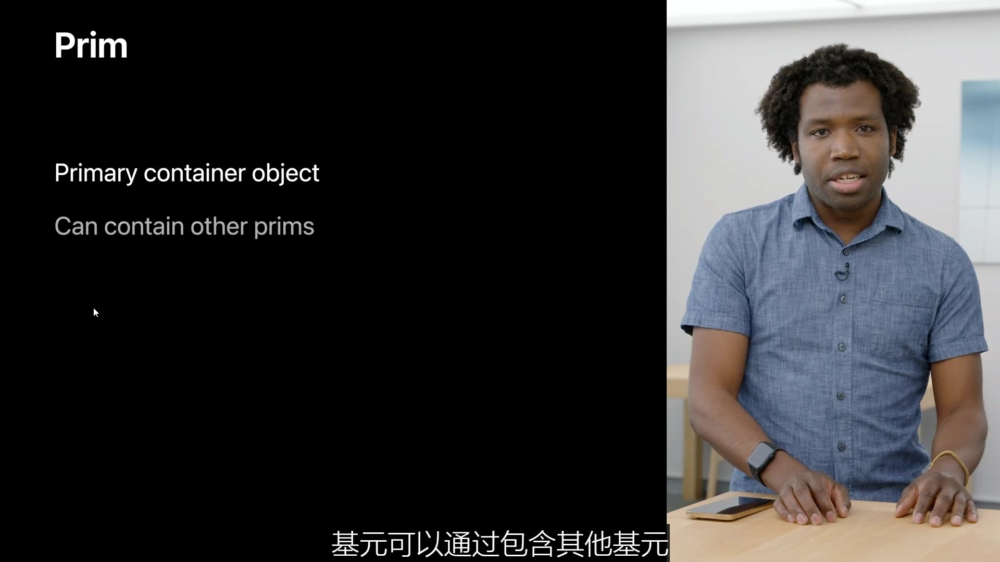

### Prim 案例1

我们来看一个例子，左侧是一个示例USD分层，在右侧我们可以看到舞台的预览视觉表述，我们可以看到两个基元一个球体和一个立方体。

### Prim Type 

每个基元都有特定的类型来定义它在舞台中代表什么，构成一个舞台的基元类型有很多，比如网格、灯光和材质，在这个例子当中，球体基元有一个名为 Sphere 的类型，立方体基元有一个名为 Cube 的类型。

## Schema（模式）

> USD 怎么知道这些基元代表的含义呢？

USD是通过使用模式来了解的，模式是用于定义基元在舞台上角色的结构化数据，它们为常见的场景概念提供意义，比如几何、材料等等。

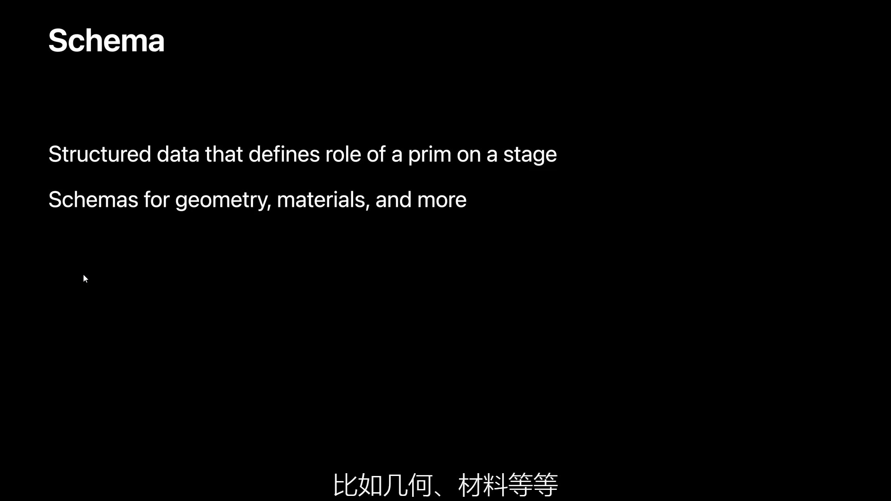

USD为你提供了丰富的内置类型基础，用于描述您的场景

### Schema 案例1

在下面这个例子中，这就是一个球体的模式定义，它定义每个球体都有半径和边界框范围。

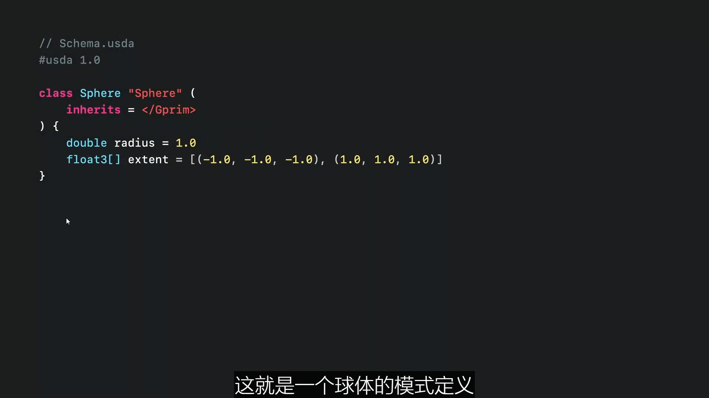

### Custom Schemas（自定义模型）

1. 自定义模式使您能够进一步扩展USD
2. 您可以提供自己的模式来表述您的自定义数据用于您自己的案例和工作流程中
3. 模式不需要具备视觉表述，它们可以只是您想在舞台上，以结构化且有意义的方式保有的数据

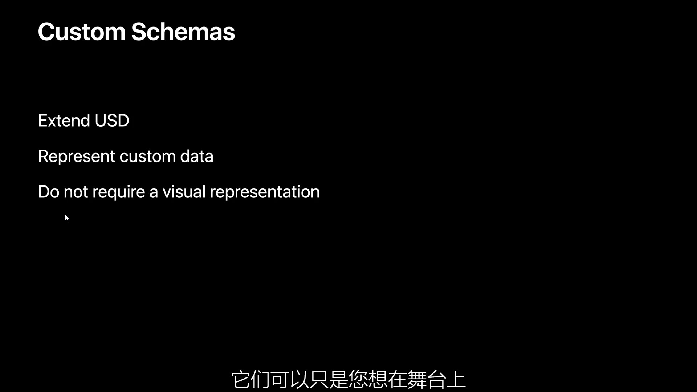

### Custom Schema 案例1

下面案例创建了一个名为 “WWDC” 的新模式，它定义了一个含有标题和相关年份的基元

这个名为 “WWDC22” 的基元 ，就使用了该模式。它已将年份设定为2022年，并将标题设为 “调用代码”，年份和标题被称作基元的“属性”。

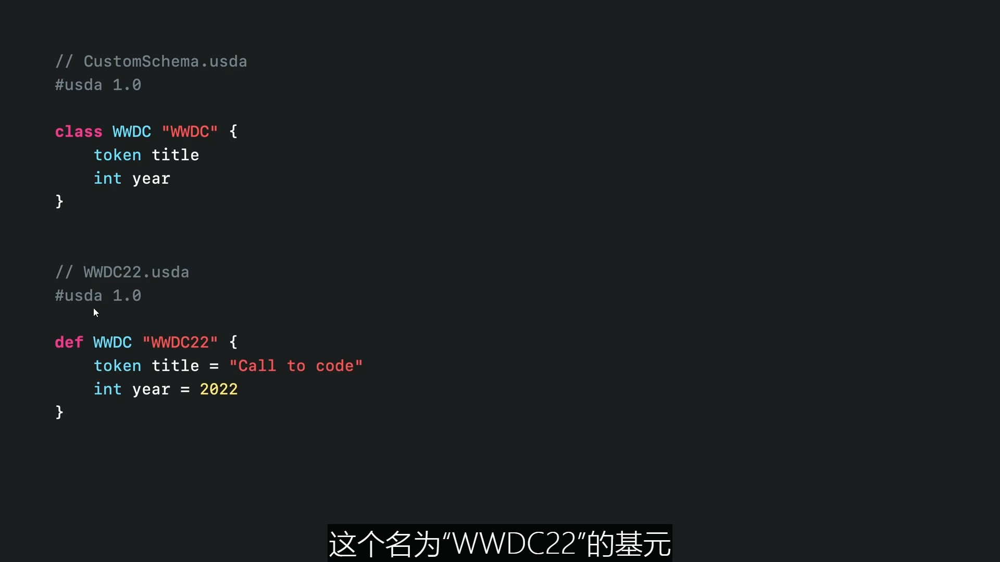

## Attributes (属性)

基元可以有各种各样的属性，每种属性都由类型和值构成，属性也可以带有创建的默认值，这样它们就不必在使用此，模式的基元中进行明确的定义。

### Attributes 案例1

回到我们的 Sphere 模式，您可以看到我们是如何为半径和范围属性定义默认值的。

这一层级中有一个单独的 Sphere 基元，由于未设置 Radius 属性，它就从 Sphere 模式中衍生出值默认半径为1，我们当然也可以明确地设置半径属性，球体看起来和之前一样，因为设置值与模式中默认的值 “1” 一致。

现在让我们添加第二个球体，并将半径设置为 0.5，我们可以看到它的确只有另一个球体的一半那么大。

## Metadata (元数据)

属性、基元和舞台也可以包含元数据，云数据是可以为场景中某些部分提供辅助数据的信息的键值对。

元数据在它适用的级别中设置，影响整个舞台的元数据和其中的所有基元都设置在舞台这一级，特定于单个基元的元数据，则设置在基元上。

属性也可以含有元数据。

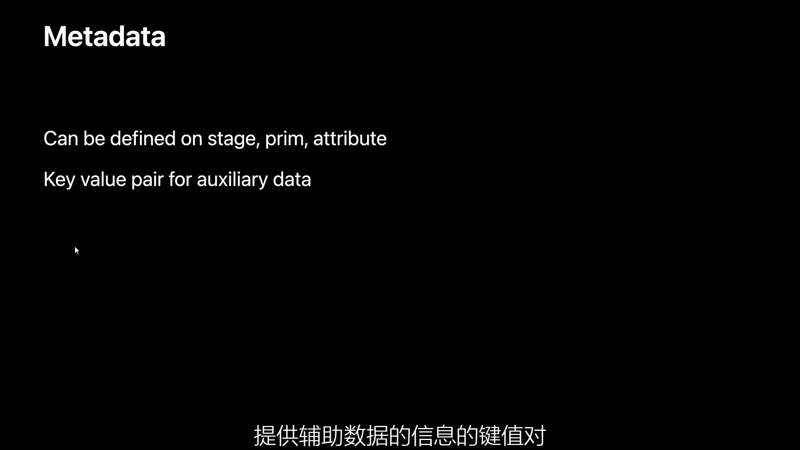

比如说下图，这是典型的舞台元数据。

1. metersPerUnit 定义场景的比例单位
2. upAxis 定义 X、Y 或 Z 轴中哪一个是对场景中相机而言朝上的方向
3. doc 字符串存储有用的文档

