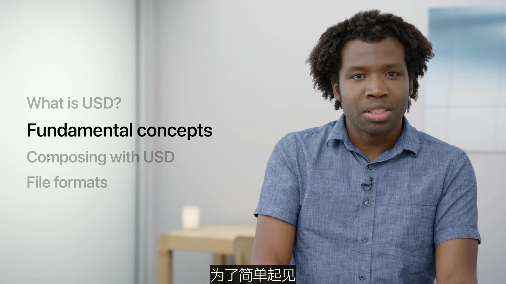
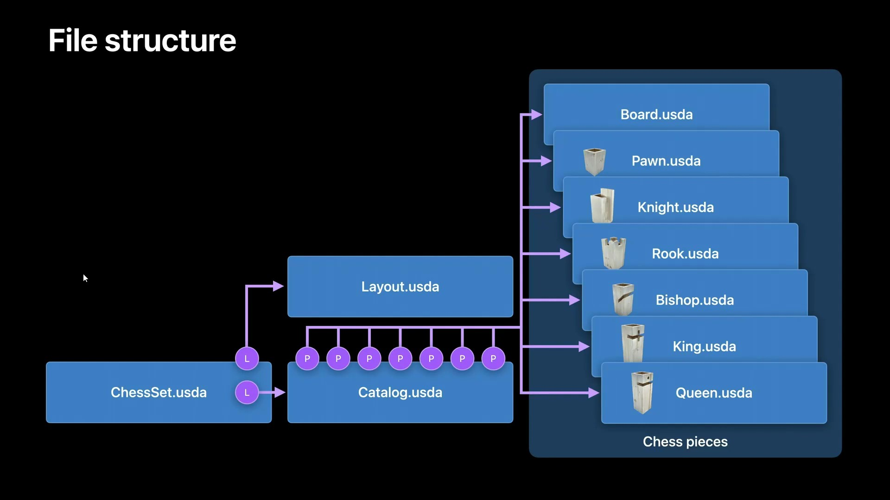

# 了解USD基本面

了解皮克斯通用场景描述（USD）的基础知识，并了解它如何帮助您构建出色的3D资产和工作流程。我们将向您介绍 USD 背后的核心概念，并探讨如何将该格式集成到您的内容创建管道中。我们还将向您展示如何通过使用组合来创建灵活和多功能的资产来利用USD的力量。

> 下面文档教程来源于苹果官网：https://developer.apple.com/videos/play/wwdc2022/10129/

## 什么是USD？

1. USD由皮克斯动画工作室开发
2. 用来创作我们喜欢的复杂电影，并广泛用于电影，娱乐和其他行业
3. 它通过设计可扩展，并迅速成为一种协作的关键工作流技术
4.  电影行业数十年制作经验的开源项目，越来越多地被游戏AR、制造和电子商务

## USD有三个核心方面

1. 场景描述规范
2. API
3. 渲染系统

### USD API

### USD 渲染系统

### 通用场景描述

我们将重点介绍，该规范说明了如何描述如何组织以及如何以文件格式表示场景数据。 从根本上说，这些USD文件包含描述场景应该如何外观的数据。 呈现应用程序解释数据，并在屏幕上生成图像。

## 深入了解基本概念

现在，让我们深入了解基本概念并了解渲染背后的数据。 为简单起见，我们将使用文本 USD 表示 有很多我们很想谈论的功能但为了节省时间我们将重点介绍最常遇到例如阶段、prim 和图层，仅举几例。

### Stage（舞台）

让我们从舞台开始。 想象一下，我们正在剧院看一场戏剧。 作为观众，我们观察着舞台上演员的表演，留意环境、灯光和道具。 这很好地类比了舞台在USD中的运作方式。

1. 一个舞台就是一个场景图表或者数据结构
2. 一个舞台是单个或多个层级的组合
3. 它们通常是包含场景信息的文件

### Prim（基元）

一般来说舞台是由基元组成的，基元是场景的主要容器对象，基元可以通过包含其它基元来创建场景元素的层级结构。

#### Prim 案例1

我们来看一个例子，左侧是一个示例USD分层，在右侧我们可以看到舞台的预览视觉表述，我们可以看到两个基元一个球体和一个立方体。

#### Prim Type 

每个基元都有特定的类型来定义它在舞台中代表什么，构成一个舞台的基元类型有很多，比如网格、灯光和材质，在这个例子当中，球体基元有一个名为 Sphere 的类型，立方体基元有一个名为 Cube 的类型。

### Schema（模式）

> USD 怎么知道这些基元代表的含义呢？

USD是通过使用模式来了解的，模式是用于定义基元在舞台上角色的结构化数据，它们为常见的场景概念提供意义，比如几何、材料等等。

USD为你提供了丰富的内置类型基础，用于描述您的场景

#### Schema 案例1

在下面这个例子中，这就是一个球体的模式定义，它定义每个球体都有半径和边界框范围。

#### Custom Schemas（自定义模型）

1. 自定义模式使您能够进一步扩展USD
2. 您可以提供自己的模式来表述您的自定义数据用于您自己的案例和工作流程中
3. 模式不需要具备视觉表述，它们可以只是您想在舞台上，以结构化且有意义的方式保有的数据

#### Custom Schema 案例1

下面案例创建了一个名为 “WWDC” 的新模式，它定义了一个含有标题和相关年份的基元

这个名为 “WWDC22” 的基元 ，就使用了该模式。它已将年份设定为2022年，并将标题设为 “调用代码”，年份和标题被称作基元的“属性”。

### Attributes (属性)

基元可以有各种各样的属性，每种属性都由类型和值构成，属性也可以带有创建的默认值，这样它们就不必在使用此，模式的基元中进行明确的定义。

#### Attributes 案例1

回到我们的 Sphere 模式，您可以看到我们是如何为半径和范围属性定义默认值的。

这一层级中有一个单独的 Sphere 基元，由于未设置 Radius 属性，它就从 Sphere 模式中衍生出值默认半径为1，我们当然也可以明确地设置半径属性，球体看起来和之前一样，因为设置值与模式中默认的值 “1” 一致。

现在让我们添加第二个球体，并将半径设置为 0.5，我们可以看到它的确只有另一个球体的一半那么大。

### Metadata (元数据)

属性、基元和舞台也可以包含元数据，云数据是可以为场景中某些部分提供辅助数据的信息的键值对。

元数据在它适用的级别中设置，影响整个舞台的元数据和其中的所有基元都设置在舞台这一级，特定于单个基元的元数据，则设置在基元上。

属性也可以含有元数据。

比如说下图，这是典型的舞台元数据。

1. metersPerUnit 定义场景的比例单位
2. upAxis 定义 X、Y 或 Z 轴中哪一个是对场景中相机而言朝上的方向
3. doc 字符串存储有用的文档

## 开始使用USD

让我们看看仅使用以上这些概念是怎么做出煎饼的场景的。

在这个层级中我们创建了名为 Pancakes 的转换基元，再添加一个名为 Blueberry_01 的转换基元，它是 Pancakes 基元的子基元，在 Blueberry_01 基元中我们加入了 Mesh 基元。

Mesh基元中保存着蓝莓的几何形状，并将其与材料绑定，让我们通过添加其他基元完成剩余资产的构建。

下面是我们仅使用基本概念完成的煎饼场景.

## USD 组合

基础知识可以让我们走得很远，但在以生产为中心的项目中我们需要与许多不同的成员团队和组织进行协作，USD有很多可以满足这一需求的功能。

通过 “组合” 来实现

### Composition（组合）

组合使通过不同场景描述单元创建舞台成为可能，它允许在实现协作和快速迭代的场景中有效的重复使用 3D 元素。

我们将讨论最常见的组合类型，分层（Layer）、引用（References）、有效负载（Payload）和变体集（VariantSet）。

### 国际象棋案例

让我们来构建一套国际象棋的场景吧。在这个场景中，我们将在目录层级中使用资产目录，它指的是我们的棋子。然后我们将这些棋子在布局层中，排列在棋盘上得到最终结果。

结果可以通过 ChessSet 层级查看。

#### 棋子对象表达

首先要制作我们的棋子，在国际象棋中有六类主要的棋子，士兵、城堡、主教、骑士、王后和国王。

我们将使用这些通过 Object Capture 创建的资产，来构建一套完整的国际象棋。

让我们先使用一个 USD 概念，来吧棋子带入到舞台，这就是引用。

### Referencing（引用）

1. 引用是指一个舞台中的基元引用另一个在同一舞台或者不同层级的基元，而无需复制数据。
2. 这有助于最大限度地减少数据重复
3. 并允许不同的人和APP分别更新数据

#### 场景引入棋子资产

让我们将士兵棋子资产引用到场景中，在目录层级中我们定义了一个名为 Pawn 的基元，添加 Pawn.usda 层级的引用。这会将士兵棋子资产引入，我们可以在目录层级看到它。

### Default prim（默认基元）

但 USD 是怎么知道应该从您引用的文件中带入哪个基元呢？

我们可以使用 defaultPrim 元数据指定这个基元。

1. defaultPrim 元数据在舞台上定义
2. 并指定在另一个舞台使用此场景时应该引用哪个基元
3. 我们建议始终为 USD 资产创建 defaultPrim

#### 给棋子资产创建 defaultPrim

检查下棋子资产，确保创建了 defaultPrim，我们可以在资产的舞台这一级看到 defaultPrim 元数据。

### Referencing by path（从指定路径引用）

在其他情况下如果没有创建 defaultPrim，或者您想引用一个与 defaultPrim 不同的基元，您可以在引用层级明确指定基元的路径，在等级结构中的任何位置均可。

### Paths (路径)

USD 中的路径用于标识舞台上的元素，基元路径是基元的唯一标识符。

#### 用棋子案例举例 Paths 的应用

用棋子案例举例来说，在这个舞台中我们可以看到三个基元。

1. “世界” 基元的基元路径为 </World>
2. “士兵” 基元的基元路径为 </World/Pawn>
3. “骑士” 基元的基元路径为 </World/Knight>

有了上面paths概念后，我们可以明确基元路径设置到我们引用中的 Pawn 基元。

###  Payloads（有效负载）

对于较大的场景一次性加载所有场景信息可能代价过高。

因此 USD 允许使用一种名为 “有效负载” 的引用类型。有效负载，例如复杂的几何图形，或其他表示道具和角色的大型场景图

1. 对将场景描述搬上舞台的动作进行延迟加载
2. 在引用大型数据集时推荐使用

#### 用棋子案例举例 Payloads

下面案例，由于我们将这些资产引用转换为有效负载，所以可以选择延迟加载棋子。

### Payloads unloaded （有效负载，不加载）

如果我们选择不加载有效负载，则场景在最初打开时显示为空。 一旦启用了加载有效负载，就可以重新看到我们的棋子。

现在我们场景中有了棋子，现在可以把它们排列在棋盘上，我们可以使用 USD 的分层（layer）概念，在另一个层级上完成。

### Layering （分层）

1. 通过分层，层级可以堆叠起来，原理类似于流行的图像编辑软件，例如 Photoshop 和 Affinity Photo
2. 位于一个层级上方另一个层级中的基元，被视为更强
3. 层级之间，可以添加或者覆盖
4. 对他层级非破坏性修改

较低层级中的数据，正如您所看见的下图中，棋子目前的位置都是错误的，但是不用担心，我们可以使用分层对其他层级进行非破坏性修改。这样非常适合在无需编辑目录层级的情况下将棋子一栋到正确的位置。

#### 用棋盘案例举例 Layering

让我们来看看在棋盘这个案例中怎么使用 Layering 分层。

**1.首先创建一个名为 ChessSet 的新舞台**

它将是我们最后的场景，在层级的顶部它包含了一个名为 “子层级” 的元数据，现在我们将棋子于目录层级一起引入。

**2.接下来，我们新建一个层级**

Layout.usda用来移动棋子

这个布局层级将包含棋子的位置信息，让我们开始覆盖棋子在场景中的位置。

我们先从 Pawn_01 开始，我们通过更改士兵棋子资产的平移属性来修改它的位置。

让我们来看看这将如何更新场景。

下面是没有布局层级的国际象棋盘，所以士兵棋子仍在它原来的位置上

一旦我们添加了布局层级，士兵棋子就被移动到了它在棋盘预期的位置

让我们对其他棋子也作同样的操作，让他们回到正确的位置

### File structure 文件结构

我们完成了棋盘 layout.usda 所有棋子调整后的文件数据结构如下图所示。

### VariantSets 变体集

剩下的就是设置对手的棋子，需要注意的是对手的棋子颜色不同，无需重新制作一套新的资产，我们可以使用另一个 USD 概念，“变体集” 来更新我们的棋子资产。

1. 变体集允许舞台上的离散代替物进行动态交换
2. 变体集中包含的变体，可以是不同的材质、几何形状，以及一切可以用 USD 表述的东西
3. 在舞台上进行不同变体之间的切换，是非破坏性的

#### 用棋盘案例举例  VariantSets 变体集

我们用在棋子的不同材质之间进行切换举例。

1. 在 “士兵” 资产中，我们添加名为 “color” 的变量集，这样就可以在士兵棋子的不同颜色之间进行切换。
2. 现在我们将两个变体添加到变体集。Dark 使用深色材质，Light 使用浅色材质。
3. 最后我们设置默认变体来指定将士兵棋子加载到舞台上时具体使用哪一个。

现在我们回到目录层级，所有的棋子都已经摆好了。但他们都使用了浅色材质，那是因为默认变体是浅色。

让我们将其中一个棋子的变体，更改为深色材质，我们可以看到对方阵营中的一个棋子变成了深色。

将设置应用于所有棋子，我们的这套国际象棋终于完成了。

### Scene graph instancing （场景图实例化）

我们还可以使用另一个 USD 概念来优化我们的场景，场景图实例化。

场景图实例化允许我们：

1. 在舞台上多次重复使用场景图的局部，用于表述任何包含不止一种元素的物件，例如树叶、家具，还有我们案例中的棋子
2. 使用场景图实例化将同时为您的 App，提供内存和性能的提升
3. 要是有场景图实例化，我们可以在基元或者场景图的局部，指定实例元数据
4. 所有实例化的基元都可以共享同一个场景图

#### 用棋盘案例举例  Scene graph instancing 场景图实例化

让我们在场景中添加对基元实例化的支持。

在目录文件夹中，我们将元数据 instanceable 添加到棋子基元，并将值设置为真。

通过添加此元数据 USD 现在将把这些资产看作共享相同的元数据的潜在可实例化基元，而不再去为每个基元复制数据

我们的国际象棋看上去还是一样，但现在它的性能和内存效率都提高了。这样一来我们这套国际象棋就完成了！

### Composition order 组合清单

1. Layering 分层
2. Referencing 引用
3. Payloads 有效负载
4. VariantSets 变体集

以上4个只是 USD 定义的几个组合类型，USD对场景图的创建有特定的强度顺序，以确保一致的场景表述。

> 有关组合的更多信息和首字母缩写为 LIVRPS 您都可以在Pixar 的 USD 文档进一步了解

## USD 文件类型

现在让我们来谈谈文件本身，以及它们出现在磁盘上的方式。

USD 文件的类型有以下几种：

1. 包含可读 ASCII 文本的 USD 文件，使用 .usda 扩展名
2. 更紧凑、更高效的二进制表述，是压缩格式，扩展名为 .usdc
3. .usd后缀 文件既可以是 ASCII 文本 也可能是二进制文件
4. 还有一个打包格式，可以将多个USD文件和相关的辅助文件比如纹理囊括在一个未压缩的 zip 存档中，使用 .usdz 扩展名

