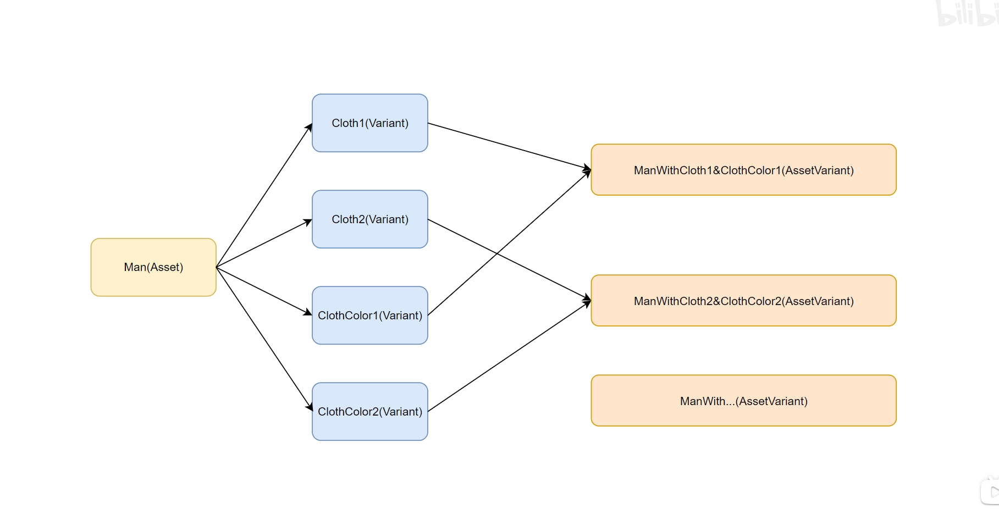

# USD资产变体

## 变体
同一个模型下面存在的不同的状态，比如同样是一个人物在不同的镜头中，有可能穿不同的衣服，同一套衣服的材质也可以不同。不同变体的组合我们称为 AssetVariant

## Variant Key

变体变量

| 参数名   | 参数类型   | 说明        |
|-------|--------|-----------|
| name  | string | 变体变量名称    |
| level | int    | 变量层级      |
| steps | list   | 变量能左右于的工序 |

## Variant

配置变体的值，可以多个值

