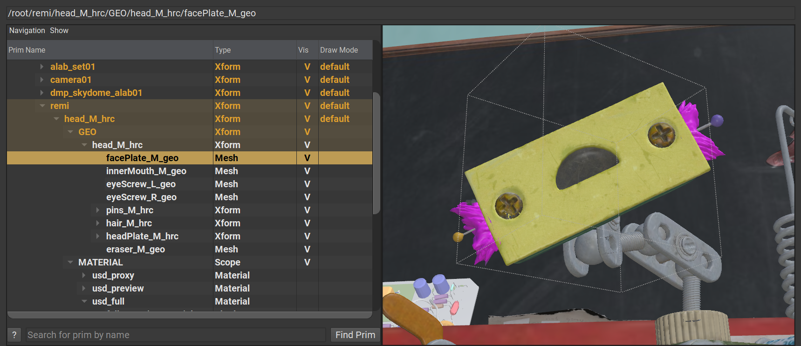

# Prims（基元）

Prims是Primitive的缩写，是USD最基本的组成部分。

Prims是层次结构中的节点，因此可以与其他Prims具有父/子关系；这意味着Prims可以拥有其他Prims作为子级或平级，或者拥有其他Prims作为父级。

!>在下图中，层次结构中的每个节点都是一个prim。

> Prim 案例
> 
> 

目光敏锐的人会注意到，Prims可以拥有一种类型。Xform、Mesh、Scope和Material是特定的Prims类型。这些类型带有默认行为和“数据”，其机制将在后面的章节中解释。

!> 用户还可以定义自己的Prim类型

虽然Prims本身表明了它们是什么“类型”的场景元素，但它们本身并不一定拥有数据。但是，它们可以被视为命名数据的“容器”，这些数据通常表示为Properties。

!> ↪ [去官网查看，USD词汇表-Prim](https://graphics.pixar.com/usd/release/glossary.html#usdglossary-prim)

