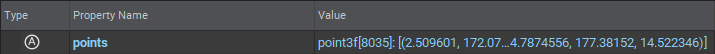
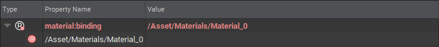

# Properties 属性

Prims可以有Properties，它们本质上是命名和类型化的数据。

在USD中一个Property，实际上是两种不同的属性类型。

> Attributes（属性）
> 
> Attributes是具有可能随时间变化的变量值的Properties
> 
> 

> Relationships（关系）
> 
> Relationships是指向其他Properties或Prims的Properties
> 
> 

在上面的内容中，您可以看到Properties（属性）是由名称和类型值组成的

这些Properties（属性）名称也可以使用名称空间。一个Properties（属性）名称可以有一个或多个命名空间标识符，用：分隔。 仔细看关系示例，Properties（属性）名称material:binding实际上是按名称空间命名的。Properties（属性）的名称本身是绑定的，它是材质名称空间的一部分。

命名空间可以用于对Properties（属性）进行分类或分组。

!> ↪ [去官网查看，USD词汇表-Properties](https://openusd.org/release/glossary.html#usdglossary-property)