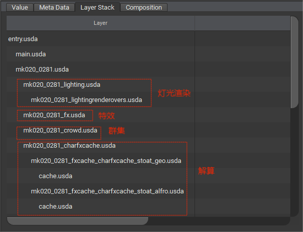

# 那么， USD到底是什么?

简而言之，USD 是描述 3D 场景层次结构的一种方式。

> USD 场景示例
> 
> 
> 
> [Animal Logic ALab](https://animallogic.com/alab/) USD 场景在USDView中显示

一般来说，层次结构由与其他节点具有父/子/兄弟关系的条目（也称为节点）组成。

在USD中，这些节点可以具有“物理性”（想想几何体、动画数据等），也可以更抽象，比如分组项目、材质、着色器，甚至“设置”可以表示为层次中的节点。

USD与其他场景描述的不同之处在于，它能够将层次结构与不同类型的行为结合在一起（这被称为[合成 composition](./basic/composition.md)）。在USD中，您可以无损地引用或移植其他层次结构，重新定义以前定义的数据，与同一层次结构中的许多其他层次结构协作，等等。

> USD场景构成示例
> 
> 
> 
> 上图在USDView中，展示了构成 [Animal Logic ALab](https://animallogic.com/alab/) 项目 USD 场景的 USD 场景列表的一部分

### 但是等一下！还有更多！

除了非破坏性地组合层次结构之外，USD还具有可扩展性。

例如，使用一个插件扩展USD，该插件可以解析定制或商业可用的文件格式，并直接在USD中使用这些文件。

!>一个具体的例子是支持直接在USD层次结构中使用FBX文件

总而言之，USD旨在通过定义一种共享的“语言”来描述场景和3D数据，从而成为一种可移植的交换格式。

这个想法并不新鲜，但USD更进一步，它还提供了一种一致绘制/渲染/图像场景的方法。这是通过USD的后端渲染技术Hydra实现的。

!>这本书目前还没有涵盖Hydra的概念，但将来可能会这样做。
